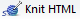
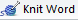
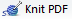

### create a file  for analysis 

In your workshop main directory, 

- Launch your *rr-workshop.Rproj* 
- File --> New File --> R Markdown 
- Output Format --> HTML 
- In the *scripts* directory, Save As --> *calibration-analysis.Rmd*

The Rmd file is pre-populated with prose and some markdown syntax. Edit the header (called a *YAML* header): 

- Change the title to *Analysis of load-cell calibration data*
- Output should be *html_document* 
- Save

```
---
title: Analysis of load-cell calibration data
author: your name
date: today's date
output: html_document
---
```


### render the Rmd script 

To *knit* the Rmd file and create the output document, 

- Save the file 
-  

The report should appear in the RStudio *Viewer* pane. Compare the pre-populated text in the Rmd file to the output document in the Viewer pane. You'll see how we use R Markdown syntax to: 

- include executable chunks of R code 
- assign a heading 
- link to a URL 
- mark text as bold 
- create a graph 

You don't have to absorb the markup language in any detail yet; we'll encounter each component as we go. 


### alternative output formats 

If you have MS Word installed on your machine (or Libre/Open Office on Unix-alikes), you can render the Rmd to Word using the Knit pull-down menu.

-  

If you have TeX installed on your machine (MiKTeX on Windows, MacTeX 2013+ on OS X, TeX Live 2013+ on Unix-alikes), you can render the Rmd to PDF 

-  

We'll use HTML output for analysis and later switch to Word output for a client report. For now, 

-  


### cleanup your directory 

If you were able to render Rmd to all three output formats, your scripts directory will contain: 

```
scripts\
  |-- calibration-analysis.docx
  |-- calibration-analysis.html
  |-- calibration-analysis.pdf 
  `-- calibration-analysis.Rmd 
```


<!--
*Save and Knit* anytime you want to see how your changes appear in the output. Remember, this is not a WYSIWYG environment---until you knit it, you won't see it. We could call it WYKIWYS (What You *Knit* Is What You *See*). 


We can dispense with the default prose. In the Rmd file, 

- Delete everything below the YAML header 
- Save and Knit 

-->


--- 
back [organize files](004_organize-files.html)<br> 
next [tbd](tbd.html)


