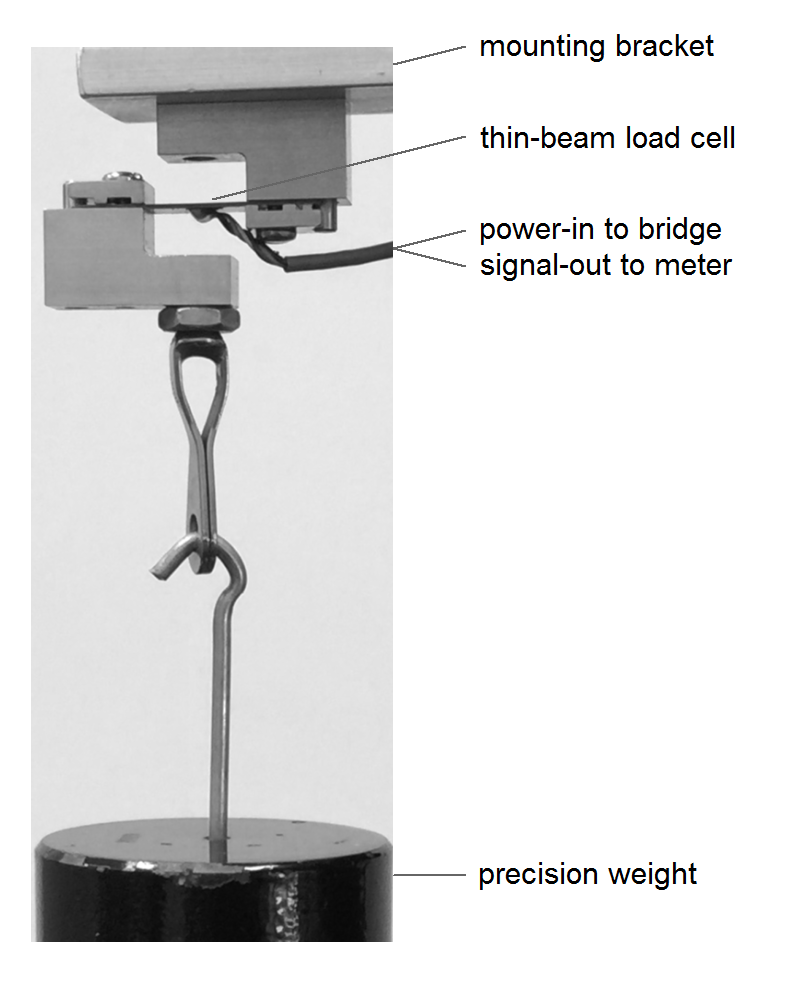

Our first paragraph establishes the context for the analysis.

- Boxed text and code chunks like those below are meant to be typed---or copied and pasted---into your Rmd script. 
- I'm using a text icon  to indicate text to add to your script
- Save and Knit after each addition to see the result and to ensure your script is error-free. 


 The hash tag in `# Introduction` denotes a level-1 heading in the output document.
```
# Introduction

Calibration test data for an Omega LCL-005 (0--5 lb) load cell (a force sensor) has been provided by the test lab. The goal of this analysis is to determine the calibration equation and estimate the sensor accuracy. 
```

 Explain the test setup and import an image.
<pre><code>The lab sent an image of the test setup. A known weight (lb) is attached to the eye hook and the load cell bridge produces an output signal (mV). 

<code>```</code>{r fig.cap = 'Figure 1. Load cell calibration test setup', out.width = '60%'}

<code>```</code>
</code></pre>

- The code chunk options `fig.cap` for adding a caption and `out.width` to  scale the size of the image. 
- The R syntax `knitr::include_graphics()` tells R to run the *include_graphics()* function from the *knitr* package
- *include_graphics()* imports the image you downloaded earlier to your `resources` directory. The file path and name are in quotes.

<div class="figure">

<p class="caption">Figure 1. Load cell calibration test setup</p>
</div>


# Examine the data 

 Start a new section.
```
# Examine the data 
```


 
 I'll use this "Insert a new code chunk" icon   to tell you to insert a code chunk then write into it the R code that follows.
 
  Read the data you downloaded and saved in the `data` directory

```r
# read the data set as received
library(readr)
data_received <- read_csv('../data/007_wide-data.csv')
```


```
First look at the data structure.
```

 Display the structure of the R "object" we've named `data_received`. 

```r
str(data_received)
```

```
## Classes 'tbl_df', 'tbl' and 'data.frame':	8 obs. of  5 variables:
##  $ test_point: chr  "2 up" "3 up" "4 up" "5 up" ...
##  $ input_lb  : num  1.5 2.5 3.5 4.5 3.5 2.5 1.5 0.5
##  $ cycle_1   : num  NA 51.1 70.4 88.8 69.4 49.5 30.7 8.7
##  $ cycle_2   : num  29.9 49.4 70 91.6 69 50.1 30.8 10.9
##  $ cycle_3   : num  30.2 49.7 NA NA NA NA NA NA
```

 Comment on the data. Asterisks around a word or phrase are the Rmd syntax for italics.
```
As expected, *read_csv()* produced a data frame. All columns are numerical except the *test_point* column that shows test condition number and a direction. Take a look at the first few rows.
```

 New paragraph. 
```
Look at the first few rows of the data set. 
```

 The *head()* function displays the first few rows of the data set. 

```r
head(data_received)
```

```
## Source: local data frame [6 x 5]
## 
##   test_point input_lb cycle_1 cycle_2 cycle_3
##        (chr)    (dbl)   (dbl)   (dbl)   (dbl)
## 1       2 up      1.5      NA    29.9    30.2
## 2       3 up      2.5    51.1    49.4    49.7
## 3       4 up      3.5    70.4    70.0      NA
## 4       5 up      4.5    88.8    91.6      NA
## 5       4 dn      3.5    69.4    69.0      NA
## 6       3 dn      2.5    49.5    50.1      NA
```


 Assess the printout. 
```
The data set has mV readings in several columns, designated *cycle_1*, *cycle_2*, etc. Thus, the data are in wide form and will have to be reshaped to long form for analysis. 

I see some NA values, which is consistent with the calibration test protocol. A summary of the numerical columns might be useful.
```

 Summary statistics except for the first column. 

```r
# summary-stats except column 1
summary(data_received[ , -1])
```

```
##     input_lb      cycle_1         cycle_2         cycle_3     
##  Min.   :0.5   Min.   : 8.70   Min.   :10.90   Min.   :30.20  
##  1st Qu.:1.5   1st Qu.:40.10   1st Qu.:30.57   1st Qu.:35.08  
##  Median :2.5   Median :51.10   Median :49.75   Median :39.95  
##  Mean   :2.5   Mean   :52.66   Mean   :50.21   Mean   :39.95  
##  3rd Qu.:3.5   3rd Qu.:69.90   3rd Qu.:69.25   3rd Qu.:44.83  
##  Max.   :4.5   Max.   :88.80   Max.   :91.60   Max.   :49.70  
##                NA's   :1                       NA's   :6
```

- *summary()* produces a statistical summary of each column in the data frame. 
- In R, square brackets `[]` subset the data frame. Here the subset `[ , -1]` tells R to keep all rows and omit the first column. 
 
  Assess the printout.
 
```
For all cycles, the mean, min, and max  readings (mV) are similar. We have NA in the first and last cycles only, as expected.  
```

# Reshape the data to long form

  New section. Underscores `_` are privileged characters in Rmd (another way to indicate italics). So to print an underscore in the text we have to "escape" the character by writing `\_`.
 
```
# Reshape the data to long form

For analysis, the data set should be in long form, with every column a  variable and every row a  observation. I've decided on the following  variable names (and what they are): 

- observ (observation number)
- cycle (cycle number)
- test\_pt (test point number and direction)
- input\_lb (applied reference force)
- output\_mV (sensor readings)
```


```
The reshaping is all about gathering the data in the *cycle* columns.  I identify which of the column names include *cycle*.
```


```r
# indices of cycle columns (listing the mV data)
is_a_cycle_col <- grep('cycle', names(data_received), ignore.case = TRUE)

# the column indices
is_a_cycle_col
```

```
## [1] 3 4 5
```

```r
# the column names at those locations
colnames(data_received)[is_a_cycle_col]
```

```
## [1] "cycle_1" "cycle_2" "cycle_3"
```

I have the correct output.

To reshape these columns, I create a new column called *cycle* for gathering the existing cycle column-names and a new column called *output_mV* for gathering the associated readings. 


```r
library(tidyr)
long_data <- data_received %>%
	gather(cycle, output_mV, is_a_cycle_col) 
print(long_data)
```

```
## Source: local data frame [24 x 4]
## 
##    test_point input_lb   cycle output_mV
##         <chr>    <dbl>   <chr>     <dbl>
## 1        2 up      1.5 cycle_1        NA
## 2        3 up      2.5 cycle_1      51.1
## 3        4 up      3.5 cycle_1      70.4
## 4        5 up      4.5 cycle_1      88.8
## 5        4 dn      3.5 cycle_1      69.4
## 6        3 dn      2.5 cycle_1      49.5
## 7        2 dn      1.5 cycle_1      30.7
## 8        1 dn      0.5 cycle_1       8.7
## 9        2 up      1.5 cycle_2      29.9
## 10       3 up      2.5 cycle_2      49.4
## ..        ...      ...     ...       ...
```

Examine the result. 


```r
str(long_data)
```

```
## Classes 'tbl_df', 'tbl' and 'data.frame':	24 obs. of  4 variables:
##  $ test_point: chr  "2 up" "3 up" "4 up" "5 up" ...
##  $ input_lb  : num  1.5 2.5 3.5 4.5 3.5 2.5 1.5 0.5 1.5 2.5 ...
##  $ cycle     : chr  "cycle_1" "cycle_1" "cycle_1" "cycle_1" ...
##  $ output_mV : num  NA 51.1 70.4 88.8 69.4 49.5 30.7 8.7 29.9 49.4 ...
```

```r
summary(long_data)
```

```
##   test_point           input_lb      cycle             output_mV    
##  Length:24          Min.   :0.5   Length:24          Min.   : 8.70  
##  Class :character   1st Qu.:1.5   Class :character   1st Qu.:30.70  
##  Mode  :character   Median :2.5   Mode  :character   Median :49.70  
##                     Mean   :2.5                      Mean   :50.01  
##                     3rd Qu.:3.5                      3rd Qu.:69.40  
##                     Max.   :4.5                      Max.   :91.60  
##                                                      NA's   :7
```

The NA entries are superfluous---they are strictly an artifact of the format of the raw data table, having nothing to do with the calibration results. I'll omit all rows with an NA in the *output_mV* column.


```r
library(dplyr)
long_data <- long_data %>%
	filter(!output_mV %in% NA)
str(long_data)
```

```
## Classes 'tbl_df', 'tbl' and 'data.frame':	17 obs. of  4 variables:
##  $ test_point: chr  "3 up" "4 up" "5 up" "4 dn" ...
##  $ input_lb  : num  2.5 3.5 4.5 3.5 2.5 1.5 0.5 1.5 2.5 3.5 ...
##  $ cycle     : chr  "cycle_1" "cycle_1" "cycle_1" "cycle_1" ...
##  $ output_mV : num  51.1 70.4 88.8 69.4 49.5 30.7 8.7 29.9 49.4 70 ...
```

It's a small enough data set, with 17  observations in 4 columns, that I can print the full set. 


```r
print(long_data)
```

```
## Source: local data frame [17 x 4]
## 
##    test_point input_lb   cycle output_mV
##         <chr>    <dbl>   <chr>     <dbl>
## 1        3 up      2.5 cycle_1      51.1
## 2        4 up      3.5 cycle_1      70.4
## 3        5 up      4.5 cycle_1      88.8
## 4        4 dn      3.5 cycle_1      69.4
## 5        3 dn      2.5 cycle_1      49.5
## 6        2 dn      1.5 cycle_1      30.7
## 7        1 dn      0.5 cycle_1       8.7
## 8        2 up      1.5 cycle_2      29.9
## 9        3 up      2.5 cycle_2      49.4
## 10       4 up      3.5 cycle_2      70.0
## 11       5 up      4.5 cycle_2      91.6
## 12       4 dn      3.5 cycle_2      69.0
## 13       3 dn      2.5 cycle_2      50.1
## 14       2 dn      1.5 cycle_2      30.8
## 15       1 dn      0.5 cycle_2      10.9
## 16       2 up      1.5 cycle_3      30.2
## 17       3 up      2.5 cycle_3      49.7
```

# Add observation numbers

The test point entries are in the order in which the data were acquired (consistent with the ANSI/ISA standard). So the observation number is the same as the row number.


```r
# add a new column
long_data$observ <- 1:nrow(long_data)
head(long_data)
```

```
## Source: local data frame [6 x 5]
## 
##   test_point input_lb   cycle output_mV observ
##        <chr>    <dbl>   <chr>     <dbl>  <int>
## 1       3 up      2.5 cycle_1      51.1      1
## 2       4 up      3.5 cycle_1      70.4      2
## 3       5 up      4.5 cycle_1      88.8      3
## 4       4 dn      3.5 cycle_1      69.4      4
## 5       3 dn      2.5 cycle_1      49.5      5
## 6       2 dn      1.5 cycle_1      30.7      6
```

# Simplify the cycle number

The *cycle* data are strings, *cycle_1*, *cycle_2*, etc. It might be useful to replace these entries with an integer for the cycle number. 

First, I separate the *cycle* column into two parts using the underscore in the data as the separation pattern. 


```r
library(stringr)
split_columns <- str_split_fixed(long_data$cycle, pattern = '_', 2)
```

I keep only the 2nd column (the cycle number), convert it to an integer (it's a character), and assign it as a new column *cycle_no* in the data frame. 


```r
long_data$cycle_no <- as.integer(split_columns[ , 2])
head(long_data)
```

```
## Source: local data frame [6 x 6]
## 
##   test_point input_lb   cycle output_mV observ cycle_no
##        <chr>    <dbl>   <chr>     <dbl>  <int>    <int>
## 1       3 up      2.5 cycle_1      51.1      1        1
## 2       4 up      3.5 cycle_1      70.4      2        1
## 3       5 up      4.5 cycle_1      88.8      3        1
## 4       4 dn      3.5 cycle_1      69.4      4        1
## 5       3 dn      2.5 cycle_1      49.5      5        1
## 6       2 dn      1.5 cycle_1      30.7      6        1
```

```r
tail(long_data)
```

```
## Source: local data frame [6 x 6]
## 
##   test_point input_lb   cycle output_mV observ cycle_no
##        <chr>    <dbl>   <chr>     <dbl>  <int>    <int>
## 1       4 dn      3.5 cycle_2      69.0     12        2
## 2       3 dn      2.5 cycle_2      50.1     13        2
## 3       2 dn      1.5 cycle_2      30.8     14        2
## 4       1 dn      0.5 cycle_2      10.9     15        2
## 5       2 up      1.5 cycle_3      30.2     16        3
## 6       3 up      2.5 cycle_3      49.7     17        3
```

Spot checking with *head()* and *tail()*, I confirm that the new cycle_no column agrees with the original cycle column data. 


# Final touches

The last steps in tidying this data set are to delete the original  *cycle* column and reuse the name for the new cycle column, to shorten the *test_point* column name, and to rearrange columns in a logical order. 


```r
tidy_data <- long_data %>%
	select(-cycle) %>%
	rename('cycle' = cycle_no) %>%
	rename('test_pt' = test_point) %>%
	select(observ, cycle, test_pt, input_lb, output_mV)
print(tidy_data)
```

```
## Source: local data frame [17 x 5]
## 
##    observ cycle test_pt input_lb output_mV
##     <int> <int>   <chr>    <dbl>     <dbl>
## 1       1     1    3 up      2.5      51.1
## 2       2     1    4 up      3.5      70.4
## 3       3     1    5 up      4.5      88.8
## 4       4     1    4 dn      3.5      69.4
## 5       5     1    3 dn      2.5      49.5
## 6       6     1    2 dn      1.5      30.7
## 7       7     1    1 dn      0.5       8.7
## 8       8     2    2 up      1.5      29.9
## 9       9     2    3 up      2.5      49.4
## 10     10     2    4 up      3.5      70.0
## 11     11     2    5 up      4.5      91.6
## 12     12     2    4 dn      3.5      69.0
## 13     13     2    3 dn      2.5      50.1
## 14     14     2    2 dn      1.5      30.8
## 15     15     2    1 dn      0.5      10.9
## 16     16     3    2 up      1.5      30.2
## 17     17     3    3 up      2.5      49.7
```

Write the tidy data to file in the data directory.


```r
write_csv(tidy_data, "../data/01_calibr_data-tidying.csv")
```


<br><br><br>
