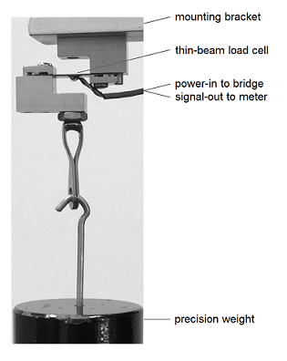

### instructions 

- Start with the Rmd file you created in [initializing a script](pages/005_initialize-script.html). 
- Save and Knit to see the output of each chunk of text or code.   
- I'll introduce R Markdown syntax as we need it. For a quick reference to the most commonly used syntax, see [Markdown basics](http://rmarkdown.rstudio.com/authoring_basics.html) by RStudio. 
- Insert a code chunk  for each chunk of R code   
- To match the *knitr* working directory to the RStudio project working directory, insert a code chunk and type (or copy and paste):


```r
library(knitr) 
opts_knit$set(root.dir = '../')
```


### introducing the subject  

In this report, we analyze calibration data from our testing lab for an Omega LCL-005 *load cell* (a force sensor). The goal of the analysis is to produce a calibration equation relating output voltage (mV) to input force (lb) and an estimate of sensor accuracy as a percentage of full span. 


- Markdown uses hash tags to format heading levels. Add `## Introduction`. 
- Add the paragraph above ("in this report, we analyze ...") to your file. Copy and paste is fine. 
- Add asterisks around a phrase for emphasis, e.g.,  `*load cell*` 
- Your file should look like: 

<pre class="r"><code>---
title: Load-cell calibration --- examine wide data
author: your name
date: 2016-08-24
output: html_document
---

<code>```{r}</code>
library(knitr) 
opts_knit$set(root.dir = '../')
<code>```</code>

## Introduction

In this report, we analyze calibration data from our testing lab for an Omega LCL-005 *load cell* ...
</code></pre>


### inserting an image 

The load-cell setup is shown in Figure 1. A known weight is suspended from the eye-hook, causing the thin-beam load cell to deform. A Wheatstone bridge on the beam detects the deformation and produces a voltage output signal that is  recorded.

- Add the above paragraph to your report. 
- R Markdown syntax to add an image is ``. This is Rmd syntax (not R code) so type it directly into the Rmd file )not a code chunk). For example, 

```

```


