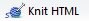
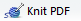

Packages used in this tutorial 

- knitr

How to use this tutorial 

- <!-- --> *add text*: type the prose verbatim into the Rmd file 
- <!-- --> *add code*: insert a code chunk then transcribe the R code 
- <!-- --> *Knit* after each addition. 

### open a new R markdown script 

In your workshop main directory, 

- Launch your project `rr-workshop.Rproj` 
- File > New File > R Markdown 
- Output Format > HTML 
- Save As > to the `scripts/` directory with filename `01_calibr_data-reshaping.Rmd`  

The Rmd file is pre-populated with prose and some markdown syntax. Edit the meta-data header:

<!-- --> (Editing the pre-populated YAML header.)

    ---
    title: "Load-cell calibration --- data tidying"
    author: "your name"
    date: "2016-08-24"
    output: html_document
    ---


### render the script 

To *knit* the Rmd file and create the output document, 

- <!-- --> icon
- `File` > `Knit Document` menu
- `Ctrl + Shift + K` keyboard shortcut

The output should appear in the RStudio Viewer pane. If you compare the pre-populated Rmd file with the rendered output document, you'll see example of commonly-needed syntax to:  

- write headings and paragraphs 
- include executable chunks of R code 
- link to a URL 
- mark bold text  
- create a graph 

We'll see most of these Rmd structures again as we work through the tutorials. 


### output to alternative formats 

If you have MS Word installed on your machine (or Libre/Open Office on Unix-alikes), you can render the Rmd to Word using the Knit pull-down menu. We'll use Word later for a client report. 

- <!-- -->

If you have TeX installed on your machine (MiKTeX on Windows, MacTeX 2013+ on OS X, TeX Live 2013+ on Unix-alikes), you can render the Rmd to PDF. (LaTeX users: you can use the Rnw file format to embed R code in LaTeX files.)

- <!-- -->

We'll use HTML output for most of our exploratory work---it renders quickly and we can ignore pagination. So for now: 

- <!-- -->


### cleanup  

In the Rmd file, 

- Edit the meta-data YAML header to return it to the form we started with above
- Delete all the rest of the pre-populated text
- Save

In the directory, 

- Delete the docx and pdf output files (if any), leaving the directory with: 

```
scripts\
  |-- 01_calibr_data-reshaping.html 
  `-- 01_calibr_data-reshaping.Rmd 
```


### initializing knitr

To include R code in our Rmd file, we place them in a *code chunk*. A code chunk opens and closes with 

<pre><code>```{r}

<code>```</code>
</code></pre>

and we write the R code in between.  Insert the delimiters using 

-  icon
- `Ctrl + Alt + I` keyboard shortcut
- Type the delimiters directly ("back ticks", not single-quotes)

The first code chunk we'll write comes at the top of the file, just after the YAML header. This code sets some options for the *knitr* package 

<!-- --> 

    library(knitr)
    opts_knit$set(root.dir = '../')
    opts_chunk$set(echo = TRUE)

Learning R and knitr:

- The *library()* function loads the *knitr* package
- `root-dir` sets the working directory for *knitr* to match the working directory for the RStudio project.  
- `echo = TRUE` applies to all subsequent code chunks in the script,  printing your R code verbatim to the output document---useful during exploratory computing. 

Edit the code chunk header as follows:

    {r, setup, include = FALSE}

- `setup` is a label. Labels are optional, but if used, every label must be unique.
- `include = FALSE` suppresses printing for this chunk. The code runs, but no print out.


Save and Knit. 


---
Back [getting organized](104_getting-organized.html)<br>
Next [examine the wide-form data](108_examine-wide-data.html)


