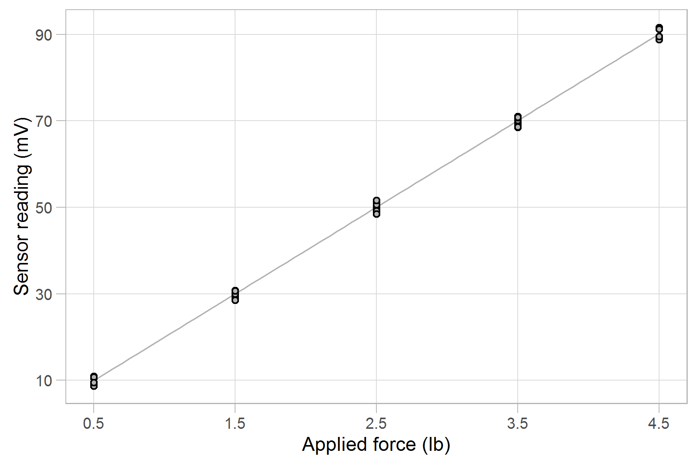

How to use this tutorial 

- <!-- --> *add text*: type the prose verbatim into the Rmd file 
- <!-- --> *add code*: insert a code chunk, then transcribe the R code 
- <!-- --> *knit* after each addition. 
- *Install* packages one time only
- *Load* a package using `library()` every session

Packages used in this tutorial 

- plyr
- dplyr
- readr

### open a new Rmd script

Open a new Rmd file, and name it `05_calibr_report.Rmd`. Save it to the `reports` directory. 

Edit the YAML header:  

    ---
    title: "Load-cell calibration report"
    author: "your name"
    date: "date"
    output: word_document
    ---

- LaTeX users can use `output: pdf_document` if they choose 
- Anyone can use `output: html_document` while editing then change to another output format for the final document sent to the client. 

Delete the rest of the pre-populated text. Insert knitr setup code

<!-- --> 

    library(knitr)
    opts_knit$set(root.dir = '../')
    opts_chunk$set(echo = FALSE)


- `echo = TRUE` is useful when writing Rmd scripts to do the work
- `echo = FALSE` is useful when writing Rmd scripts that produce a client report

Knowing the packages we'll be using, we can load them right away, near the top of the file.

<!-- -->


```r
# load packages
library(plyr)
suppressPackageStartupMessages(library(dplyr))
library(readr)
```

Start the prose for the client report. 

<!-- -->

    # Introduction

    The goal of this analysis is to determine the calibration equation and sensor accuracy for an Omega LCL-005 (0--5 lb) load cell. 

    The test setup is illustrated in Figure 1. Precision weights (0.1% accuracy) are used to apply the reference force (lb) to the load cell and the resulting voltage readings (mV) from the sensor are recorded. The test procedure follows the ANSI/ISA-1979 standard. 
    
### add an image

<!-- -->


```r
knitr::include_graphics("../resources/load-cell-setup-786x989px.png")
```

- To add a figure caption, we add an argument to the code chunk header, e.g. `{r fig.cap = "Figure 1. Load cell calibration test setup"} `. 

### prepare data and results for display

Here we load the data we need for the report and isolate several variables used in the prose. 

<!-- -->

    # Data

<!-- -->


```r
# itemized results that are cited in the report 
results <- read_csv('results/04_calibr_outcomes.csv')

# find and extract the slope of the regression curve
slope_position <- results$item == "slope"
slope          <- results$num[slope_position]
```

Learn R

- `results$item` yields the `item` vector of strings
- `==` is a logical operator, comparing each element of the `results$item` vector to the string `"slope"`
- `slope_position` is a logical vector, with `TRUE` in the position of the `"slope"` element
- `results$num` yields the `num` vector of numbers which is then subset further by `[slope_position]` to return a single numerical value 

The code could be shortened by combining the two lines of code into one, e.g. `slope <- results$num[results$item == "slope"]`, eliminating the explicit `slope_position` variable. In the next code chunk, we use this shortcut and repeat the process for variables stored in the `results` data frame that we might need in the report. 

<!-- -->


```r
intercept   <- results$num[results$item == "intercept"]
accuracy    <- results$num[results$item == "accuracy"]
resid_bound <- results$num[results$item == "resid_bound"]
input_min   <- results$num[results$item == "input_min"]
input_max   <- results$num[results$item == "input_max"]
output_min  <- results$num[results$item == "output_min"]
output_max  <- results$num[results$item == "output_max"]
```

We can extract units from the data frame in the same way. 

<!-- -->


```r
input_units  <- results$unit[results$item == "input_max"]
output_units <- results$unit[results$item == "output_max"]
```

Next we can compute quantities we will need in the report that depend on the numbers we just isolated. 

<!-- -->


```r
# compute range and span
output_span <- output_max - output_min
input_range_fraction <- round(input_max / 5 * 100, 1)
```

### use inline code chunks

<!-- -->

<pre class="r"><code>The calibration data are shown in Table 1. The maximum force (<code>`</code>r input_max<code>`</code> lb) is <code>`</code>r input_range_fraction<code>`</code>% of the 5 lb sensor limit, meeting the requirements of the ANSI/ISA standard.
</code></pre>

Learn knitr

- \` r ... \` is an *inline code chunk*. Anything inside the chunk is evaluated as R code with the result printed in the sentence. 

Inline code chunks are useful for reporting values in your prose that depend on computations. Thus the inline code chunk  \``r` `input_max` \` is replaced by the number 4.5 in the sentence. 

### print a table

<!-- -->


```r
# read the data set as received
data_received <- read_csv('data/007_wide-data.csv')
```

If you type `names(data_received)` in the Console, you see that the column names use underscores, e.g., test_point, input_lb, cycle_1, etc. --- good for machine readability but not so much for human clients.   

<!-- -->


```r
readable_data <- data_received %>%
	select("Input (lb)" = input_lb, "Cycle 1 (mV)" = cycle_1, "Cycle 2 (mV)" = 
cycle_2, "Cycle 3 (mV)" = cycle_3)
```

- `select("new name" = old_name)` edits the column names

We choose columns names punctuated as we want them to appear in the table heading row. 

<!-- -->


```r
kable(readable_data, caption = "Table 1. Calibration data")
```

Learn knitr

- `kable()` is a `knitr` function that produces simple tables in the output document
- `caption = "..."` argument produces a caption for the table. Tables made with `kable()` are not automatically numbered, though one can write a function to do that. 

### write inline math

<!-- -->

    # Results
    
    The calibration data and calibration curve are shown in Figure 2. The maximum $\pm$ deviations of the data from the best-fit curve (residuals) are the values used to estimate sensor accuracy. 
    
Learn LaTeX math syntax

- `$\pm$` is LaTeX math syntax to produce the plus/minus symbol $\pm$

R markdown evaluates LaTeX math syntax ([introduction here](https://www.sharelatex.com/learn/List_of_Greek_letters_and_math_symbols)) and prints the result to the output document. 

### add a graph 

<!-- -->


```r

```

- To add a figure caption, we add an argument to the code chunk header, e.g. `{r fig.cap = "Figure 2. Load cell calibration curve"} `. 

### write display-style math

Use LaTeX display math to write the calibration equation. The display math includes inline R code chunks. 

<!-- -->

<pre><code>The calibration equation is
$$
y = <code>`</code>r sprintf("%.3f", slope)<code>`</code>  x + <code>`</code>r sprintf("%.3f", intercept)<code>`</code>
$$
with *x* in <code>`</code>r input_units<code>`</code> and *y* in <code>`</code>r output_units<code>`</code>.
</code></pre>

Learn R

- Double dollar signs mark a LaTeX math expression displayed on its own line 
- `sprintf("format", variable)` prints the value of the variable name using the format shown, in this case, a floating point number with 3 decimal places. To learn more, type `?sprintf` in the R console.
- Placing this R code inside an inline code chunk prints the value to the output
    


<!-- -->

<pre><code>The largest residual is <code>`</code>r sprintf("%.1f", resid_bound)<code>`</code> mV and the output span is <code>`</code>r sprintf("%.1f", output_span)<code>`</code> mV, yielding a sensor accuracy as a percent of reading of
$$
\pm <code>`</code>r sprintf("%.1f", accuracy)<code>`</code>\%. 
$$
The accuracy of the precision weights, 0.1%, is less than one tenth the load cell accuracy, as expected by the ANSI/ISA standard.
</code></pre>

- Again, several instances of inline R code with numbers formatted using `sprintf()`
- To print the percent symbol (%) in a LaTeX math expression, we have to "escape it" by typing `\%`, otherwise, LaTeX treats the symbol as the comment character. 
 
### check yourself

Navigate to your reports directory. it should look like this:

    reports\
      |-- 05_calibr_report.docx
      `-- 05_calibr_report.Rmd

---
Back [perform a linear regression](112_regression.html)<br>
Next [adding references](114_references.html)


