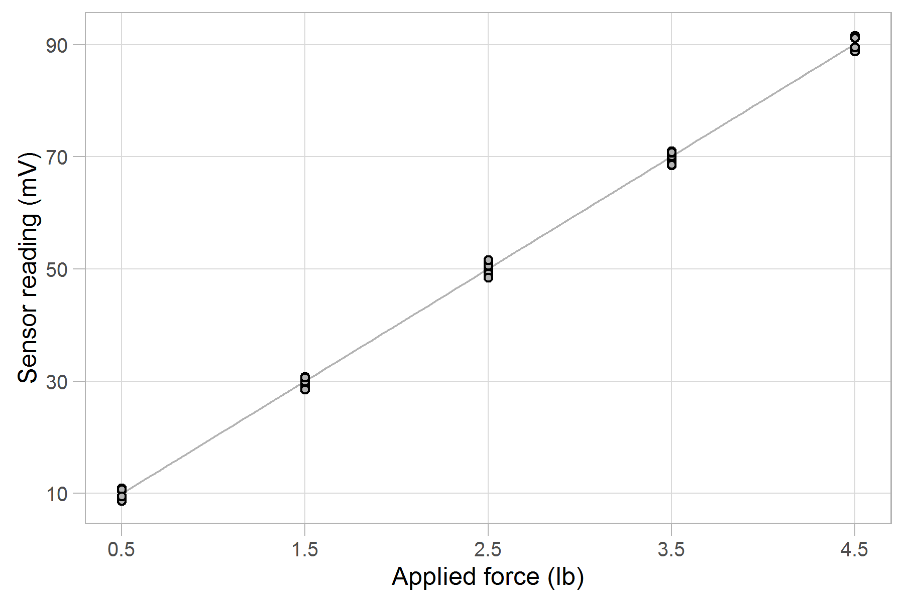

```{r 05-01, include = FALSE}
library(knitr)
opts_knit$set(root.dir = '../')
opts_chunk$set(echo = FALSE)
```

```{r 05-02}
library(plyr)
suppressPackageStartupMessages(library(dplyr))
library(readr)
```


# Introduction

The goal of this analysis is to determine the calibration equation and sensor accuracy for an Omega LCL-005 (0--5 lb) load cell. 

The test setup is illustrated in Figure 1. Precision weights (0.1% accuracy) are used to apply the reference force (lb) to the load cell and the resulting voltage readings (mV) from the sensor are recorded. The test procedure follows the ANSI/ISA-1979 standard. 

```{r 05-03, fig.cap = 'Figure 1. Load cell calibration test setup'}
knitr::include_graphics("../resources/load-cell-setup-786x989px.png")
```

# Data

```{r 05-04}
# itemized results that are cited in the report 
results      <- read_csv('results/04_calibr_regression-results.csv')

# extract numbers and units
slope        <- results$value[results$item == "slope"]
intercept    <- results$value[results$item == "intercept"]
accuracy     <- results$value[results$item == "accuracy"]
resid_bound  <- results$value[results$item == "resid_bound"]
input_min    <- results$value[results$item == "input_min"]
input_max    <- results$value[results$item == "input_max"]
output_min   <- results$value[results$item == "output_min"]
output_max   <- results$value[results$item == "output_max"]
input_units  <- results$units[results$item == "input_max"]
output_units <- results$units[results$item == "output_max"]

# compute range and span
output_span <- output_max - output_min
input_range_fraction <- round(input_max / 5 * 100, 1)
```

The calibration data are shown in Table 1. The maximum force (`r input_max` lb) is `r input_range_fraction`% of the 5 lb sensor limit, meeting the requirements of the ANSI/ISA standard.

```{r 05-05}
# read the data set as received
data_received <- read_csv('data/007_wide-data.csv')
data_received <- data_received %>%
	select("Input (lb)" = input_lb, "Cycle 1 (mV)" = cycle_1, "Cycle 2 (mV)" = 
cycle_2, "Cycle 3 (mV)" = cycle_3)
	
kable(data_received, caption = "Table 1. Calibration data")
```

# Results

The calibration data and calibration curve are shown in Figure 2. The maximum $\pm$ deviations of the data from the best-fit curve (residuals) are the values used to estimate sensor accuracy. 

```{r 05-06, fig.cap = 'Figure 2. Load cell calibration curve'}

```

The calibration equation is
$$
y = `r sprintf("%.3f", slope)`  x + `r sprintf("%.3f", intercept)`
$$
with *x* in `r input_units` and *y* in `r output_units`.

The largest residual is `r sprintf("%.1f", resid_bound)` mV and the output span is `r sprintf("%.1f", output_span)` mV, yielding a sensor accuracy as a percent of reading of 
$$
\pm `r sprintf("%.1f", accuracy)`\%. 
$$
The accuracy of the precision weights, 0.1%, is less than one tenth the load cell accuracy, as expected by the ANSI/ISA standard.  


