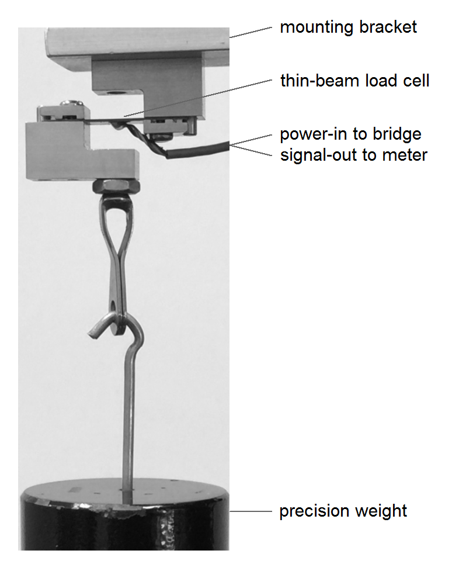

## Introduction

Calibrating a *load cell* (a sensor for measuring uniaxial force) yields two main results: a calibration equation relating output voltage (mV) to input force (lb); and an estimate of sensor accuracy as a percentage of full span. This report presents the test results for an Omega LCL-005 load cell calibrated following the ANSI/ISA procedure.

The load-cell setup is shown in Figure 1. A known weight is suspended from the eye-hook, causing the thin-beam load cell to deform. A Wheatstone bridge on the beam detects the deformation and produces a voltage output signal that is  recorded.

