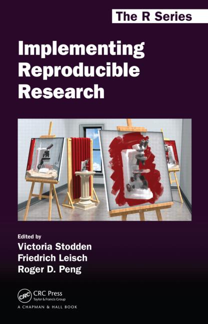

---
output:
  revealjs::revealjs_presentation:
    css: my_simple.css
    transition: fade
    center: false
    reveal_options:
      slideNumber: true
      width: 1200
---

##  Creating reproducible reports
<!-- custom title page -->

A workshop in reproducible research for the R novice

 Richard Layton

<small>
Department of Mechanical Engineering  
Rose-Hulman Institute of Technology  
2016-08-24  
</small>
 

## Welcome

How complete is your homework? Find a partner at the same level.  

- Homework is complete. 
- Homework is partially complete.   
- What homework?  

 Get connected

- Guests: network, login, password  
- Tutorials: https://dsr-rhit.github.io/creating-reproducible-reports/  
- Connect your device to the pod.   

## Getting started

Introductions

Does everyone have the handout for Mystery Question 1?

 

<large>*What is reproducible research?*</large>

## Attributes of reproducible research

 

- Independent scientists compute quantitative results using the original datasets and methods 

- Large data sets, sophisticated models, computation 

- New scientists are generally unprepared to work reproducibly    

## Attributes of reproducible research

 

- Data and code used to make a finding are available and sufficient to recreate the finding  

- Data gathering, data analysis, and presentation of results

- Resesarch will be reproduced only if it is easy to reproduce   

## Initial steps towards reproducibility

 

- Everything with a script  
- Organize your data and code  
- Automate the process  
- Turn scripts into reproducible reports  
- Turn repeated code into functions  
- Package functions for reuse  
- Use version control  
- License your software  

 <small>Karl Broman  
http://kbroman.org/steps2rr/ </small>

## Good enough practices 

 

- Plan the data management    
- Use readable, reusable, and testable software   
- Aim for simplicity and clarity  to engance collaboration 
- Organize files in a logical and consistent  fashion 
- Use version control  
- Agree on a workflow before starting a manuscript 

 <small>Jenny Bryan, Karen Cranston, Justin Kitzes, Lex Nederbragt, Tracy Teal, and Greg Wilson  
https://github.com/swcarpentry/good-enough-practices-in-scientific-computing/blob/gh-pages/index.md </small>

