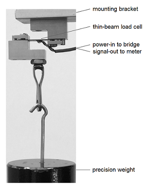

[//]: this is a comment in Rmd

### headings, italics, and importing an image

Add this text to your Rmd file. Save and Knit. 

```
## Introduction

In this report, we analyze calibration data for an Omega LCL-005 *load cell* (a force sensor). The goal of the analysis is to produce a calibration equation relating output voltage (mV) to input force (lb) and an estimate of sensor accuracy as a percentage of full span.

The calibration test setup is shown in Figure 1. A known weight is suspended from the eye-hook, causing the thin-beam load cell to deform. A Wheatstone bridge on the beam detects the deformation and produces a voltage output signal that is  recorded.


```

R Markdown syntax: 

- Heading-level using hash tags, e.g., `## Introduction` is a level-2 heading.
- Emphasis (italics) using asterisks, e.g., `*load cell*`.
- Import an external image with caption using `` in a paragraph by itself. 
- [Markdown basics](http://rmarkdown.rstudio.com/authoring_basics.html) for reference.

Note that the image is imported using a relative file path:  `../` takes us up one level from `scripts` (where this file resides) to `rr-workshop` (the project main directory), then `resources/` takes us into the resources folder and `load-cell-setup-315x396px.png` finds the image you downloaded earlier. 


