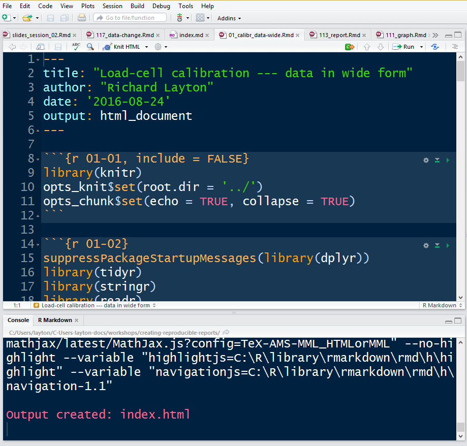
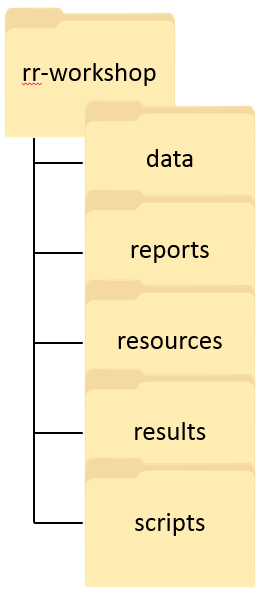

---
output:
  revealjs::revealjs_presentation:
    css: my_simple.css
    transition: fade
    center: false
    reveal_options:
      slideNumber: true
      width: 1200
---

##  Creating reproducible reports
<!-- custom title page -->

A workshop in reproducible research for the R novice

 

Session 2

 
 
Richard Layton

<footnotesize>
Department of Mechanical Engineering  
Rose-Hulman Institute of Technology  
2016-08-24  
</footnotesize>

***

<h2>Session 2 agenda</h2>

 

  
<mycaption>What's in your data science toolbox?</mycaption> 

  

<footnotesize>Image courtesy  [Pixabay.](https://pixabay.com/en/tools-hammer-saw-shovel-575622/)</footnotesize>

 

 

Reproducible reports

- Q&A 
- Continue the tutorials
- When the data change 

Take the next steps 

- What tasks have we scripted? 
- Plan for reproducibility 
- Start your own project 

Wrap-up 

- Summarize your progress 
- Look ahead	 
- Assess the workshop 

## Reproducible reports

 

- Q&A 

- Continue the tutorials

- When the data change 

## Principle 1: Blend computing, results, and narrative

 

Reviewing the tasks we've scripted

- import an image file  
- read a data file 
- create a data table and write it to file 
- perform data carpentry to tidy the data 
- reshape data from wide to long form 
- create a graph and save it to file 
- perform a linear regression 
- extract relevant results and write to file 
- write a reproducible client report 

 

  

 

 

***

<h2>Principle 2: Organize for reproducibility from the beginning</h2>

  

- everything is a script 

- every script is connected 

- file management is planned 

    - directory structure 
 
    - file naming scheme 

 

